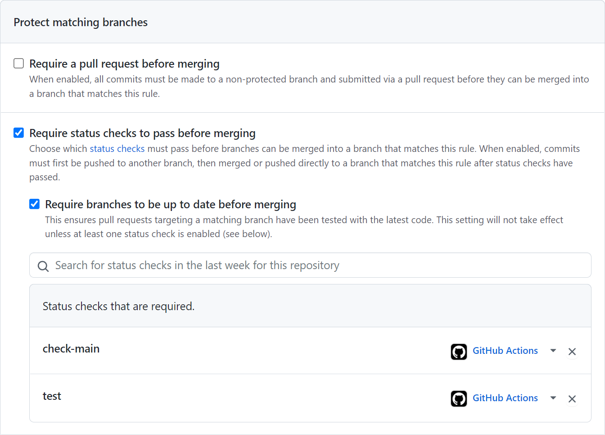

# Stop Merging

This action provides a status check to stop merging Pull Requests into your main branch, when your main branch is broken.

## Problem statement

When multiple developers work actively on the same repository, it can happen that developer A breaks the main branch but developers B and C are still merging their PRs into the main branch. Developers B and C won't be notified if they introduced additional bugs as the branch is already broken by developer A. It can therefore be beneficial to create a code freeze on the main branch so that developer A can provide a fix without running into additional merge conflicts or bugs introduced by developers B and C. The fix that will be provided by developer A can bypass the status check when a special prefix (like "fix") is used in the commit message.

## What means "broken"?

Your main branch is considered to be broken, when the latest commit on this branch has a failing [status check](https://docs.github.com/en/pull-requests/collaborating-with-pull-requests/collaborating-on-repositories-with-code-quality-features/about-status-checks).

## How to install?

1. [Install this action](https://github.com/marketplace/actions/stop-merging) from the GitHub Marketplace
2. [Add branch protection](https://docs.github.com/en/repositories/configuring-branches-and-merges-in-your-repository/defining-the-mergeability-of-pull-requests/about-protected-branches) rule to your GitHub repository
3. [Require status checks](https://docs.github.com/en/repositories/configuring-branches-and-merges-in-your-repository/defining-the-mergeability-of-pull-requests/troubleshooting-required-status-checks) to pass before merging

### 1. Install this action

It's as simple as creating this file:

**.github/workflows/stop-merging.yml**

```yml
name: 'Check Mergeability'

on:
  pull_request:
    # With "edited" it runs on PR title updates
    types: [opened, edited, synchronize, reopened]

jobs:
  check-main:
    runs-on: ubuntu-latest
    steps:
      - uses: bennycode/stop-merging@v0.1.3
        with:
          GITHUB_TOKEN: ${{ secrets.GITHUB_TOKEN }}
          GIT_BRANCH: 'main'
          BYPASS_PREFIX: 'fix'
```

### 2. Add branch protection

Equip your base branch with branch protection rules:


### 3. Require status checks

It is recommended to add a status check that detects if your branch is broken (for example, a unit test check) and an additional check for the "Stop Merging" action (i.e. "check-main"):



## How to use?

When configured as a status check, this action will make your open Pull Requests fail when your configured main branch is broken. Only Pull Requests matching a specific title (for example "fix: Main branch") will be allowed to be merged in order to recover the health of your main branch. Once your main branch is green again, you can rerun the failing Stop Merging status checks to also become green again.

## Configuration

The following parameters can be configured:

- `GITHUB_TOKEN`: Token to be used by the Stop Merging action to authenticate with your repository
- `GIT_BRANCH`: Git branch to check for status (defaults to **main**)
- `BYPASS_PREFIX`: Prefix for commit messages that can bypass the status check (defaults to **fix**)

Example:

```yml
steps:
  - uses: bennycode/stop-merging
    with:
      GITHUB_TOKEN: ${{ secrets.GITHUB_TOKEN }}
      GIT_BRANCH: 'main'
      BYPASS_PREFIX: 'important'
```

## Release Process

1. Code gets compiled and bundled together with all its dependencies into a single file using `ncc`
2. The bundled file is being referenced in [action.yml](./action.yml)
3. Bundled code is uploaded to the repository
4. New version gets semantically tagged in Git and released on GitHub

## References

- [GitHub Actions](https://github.com/features/actions)
- [Commit Statuses](https://docs.github.com/rest/commits/statuses)
- [Check Suites](https://docs.github.com/rest/checks/suites)
- [TypeScript Template for GitHub Action](https://github.com/actions/typescript-action)
